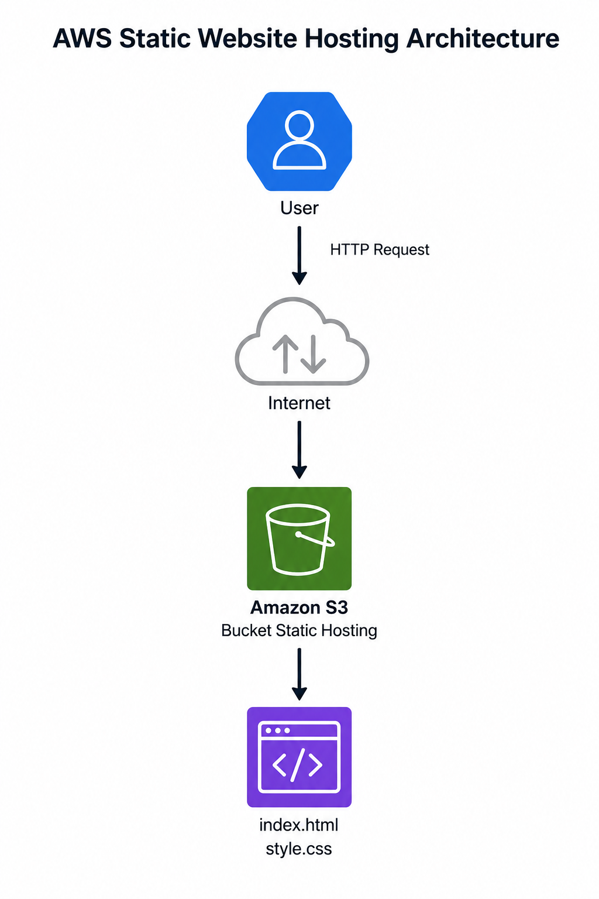
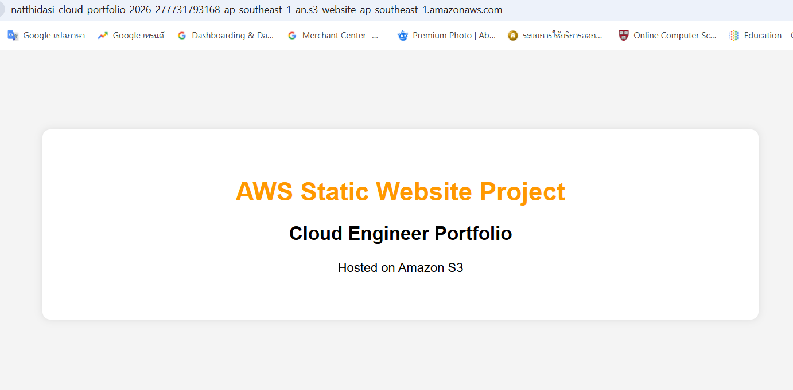

# aws-static-website-project
Deploy a static website on AWS S3 following cloud engineering best practices.
# AWS Static Website Hosting on Amazon S3


## Project Overview

This project demonstrates how to deploy a static website using Amazon S3 Static Website Hosting.

The objective was to gain hands-on experience with AWS cloud services, website hosting, access control, GitHub version control, and cloud architecture documentation.

---

## Architecture Diagram



---

## Live Demo

Website Endpoint:

http://natthidasi-cloud-portfolio-2026-277731793168-ap-southeast-1-an.s3-website-ap-southeast-1.amazonaws.com

---

## AWS Services Used

| Service       | Purpose                |
| ------------- | ---------------------- |
| Amazon S3     | Static website hosting |
| Bucket Policy | Public website access  |
| AWS Console   | Resource management    |

---

## Project Structure

```text
aws-static-website-project
│
├── architecture
├── docs
├── screenshots
├── website
└── README.md
```

---

## Deployment Process

1. Create Amazon S3 Bucket
2. Upload Website Files
3. Enable Static Website Hosting
4. Configure Bucket Policy
5. Verify Website Endpoint

---

### Live Website



---

## Challenges and Solutions

### Challenge: AccessDenied (403 Forbidden)

Problem:

The website returned an AccessDenied error after deployment.

Solution:

* Disabled Block Public Access
* Updated Bucket Policy
* Verified Website Endpoint Configuration

### Challenge: Git Commit Failure

Problem:

Git refused to create commits due to missing user identity.

Solution:

Configured Git user.name and user.email.

---

## Lessons Learned

* Amazon S3 Fundamentals
* Static Website Hosting
* Bucket Policy Configuration
* Public Access Management
* Git and GitHub Workflow
* Cloud Documentation Best Practices

---

## Skills Demonstrated

* AWS S3
* Static Website Hosting
* Cloud Architecture
* Git
* GitHub
* HTML
* CSS
* Technical Documentation

---

## Future Improvements

* Amazon CloudFront CDN
* HTTPS using AWS Certificate Manager
* Route 53 Custom Domain
* GitHub Actions CI/CD
* Terraform Infrastructure as Code

---

## Author

Natthida Sirapongkulpoj

Aspiring AWS Cloud Engineer & AWS Solutions Architect
